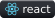
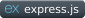

# Somaiya Awards System 

## Progress Report


#### DONE
- [x] Model Rewrite and Optimization
- [x] Model Type-Safety
- [x] Middleware Rewrite and Correction
- [x] Patching Security and implemented Access-Refresh JWT Token   
- [x] AuthController and AdminController done 
- [x] Zod added and updated
- [x] Make it run actually
- [x] Updating axios and Customization
- [x] Limiting what data is send
- [x] Controller Rewrite and Optimization
- [x] Use IndexedDB to store form state
- [x] Allow for File Preview
- [x] IEAC Feedback scores 
- [x] Jest Tests
- [x] Make it TSC compatible to verify frontend and backend builds correctly

#### TODO
- [ ] House Forms
- [ ] Change Student Forms Scoring
- [ ] Routes Updation
- [ ] Frontend Rewrite and updating Library
- [ ] Full-Stack Type Safety

#### MAYBE
- [ ] Use tRPC (Pros: More Type Safety, Cons: It has it's own configs and need special routing. TLDR: Route Rewrite v2)

### Documentation


#### Introduction

Somaiya Awards system is a full stack web application for all institutes under Somaiya Trust . The web application was built to ease the process of filling out the applications for somaiya awards and selecting the best candidate of all . The web application helps the user to analyze each applicant based on their form scores and overall feedback

#### Technologies 

- Frontend :       

- Backend :       

- Database : 

___

### Getting Started 
___
#### Installation

Clone the project

```bash
git clone "https://github.com/Somaiya-Awards/somaiya-awards"
```

Open the project directory
```bash
cd somaiya-awards
```

Setting Up Frontend

```bash
cd frontend
npm install 
npm run dev
```


Setting Up Backend Server

```bash
cd backend
npm install
npm run dev
```

Once you are completed installing dependencies in backend, setup environment by saving the *.template files as *. files and adding necessary credentials.

> **Note**
> Not editing the env file may not affect your server startup but may cause errors in actions where email is to be sent via backend server (see mailing section below)<br>This video might help you to create App Key if you dont know [Link to Youtube Video](https://www.youtube.com/watch?v=hXiPshHn9Pw)

## Guidelines

- Backend contains only backend logic
- Frontend contains only frontend logic
- Shared contains functionality like zod Validators (only common validators) or types (only common types) used by both frontend and backend
- Verify that frontend, backend, shared compile into typescript using the following command:

    ```bash
    npm run build:test 
    ```
- Add linting options if you need more Type safety
